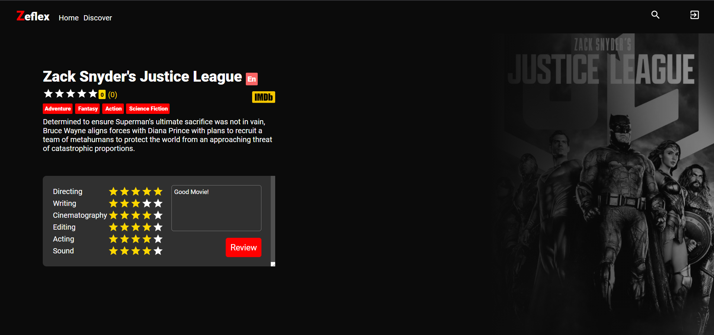

# Zeflex 
_**Zeflex**_ is a website application inspired from _**Netflix**_ that allows users to Search for Movies, See Movie's Description, Review Movies and more.

### **You can See it live  [here](http://zeflex.onrender.com/)**

# More About Zeflex Functionalities

1. Auth
* User Must login to be able to review movies

2- Discover
* Allows User to discover random movies that changes every time the user visits the page

3- Search
* Allows User to Search for a specific Movie 
* User can filter the result either by the release date , for kids , genre( can be more than one) or any combination of those

4- Movie Page 
* Allows users to see more details about a movie like language, genres,overview ,reviews ,videos,....
* User Can review a movie for **ONE TIME ONLY**

5- Admin Page
* Allows admins to create and edit movies,genres,users 
* 

## Architecture
Zeflex uses **Django Rest Framework** for backend and **React** for front end.   
It allows two type of authentication :
1. Token Authentication 
2. Session Authentication ( Mainly for admin page)
      

# Distinctiveness and Complexity
* This project uses React for the entire front-end and doesn't use Django templates (except for the admin page)
* Uses Django Serializers to Transfer and Validate Data
* Allows Token Authentication 
* Filtering Movies proccess is totally dynamic

### Files
* SQL DB : i have attachd a sqlite db that i've populated from https://developers.themoviedb.org/  (this file is optional though)
* * ##### build 
the actual files that is rendered by django server
* ##### src
includes the react app code Folder Structure:
* api_interface js file that is responsible for fething data from the backend
* Components,Screens folders containing the react components , screens each one has a js file and scss file

To run the application first you need to install required pip packages
> pip install -r requirments.txt

then run the command 
>python manage.py runserver

and that's it :)
